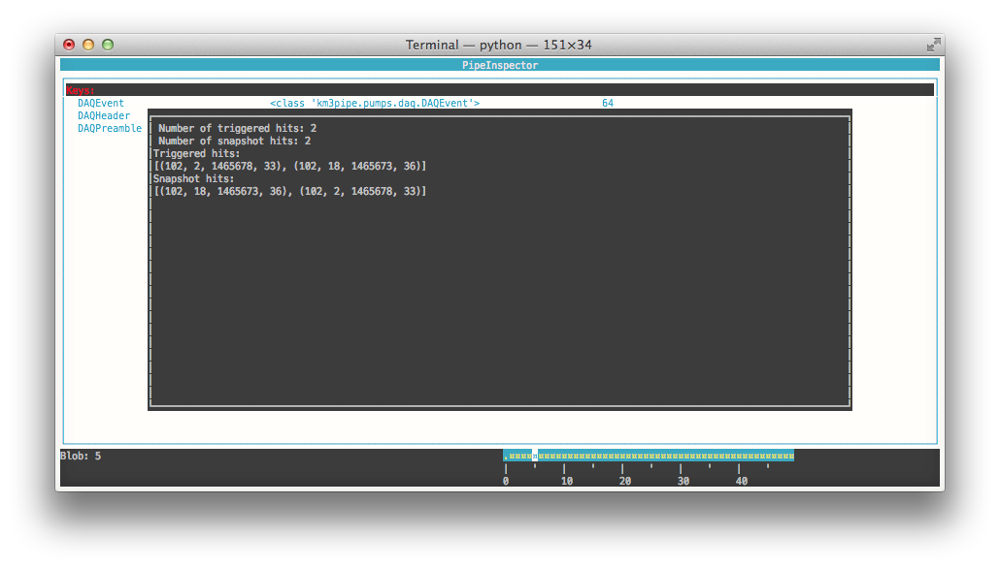

Command Line Tools
==================

.. contents:: :local:

If you've installed KM3Pipe via ``pip``, you have access to some useful
command line utilities out of the box.

KM3Pipe
-------

Most of the commands have to be prefixed with ``km3pipe`` to avoid possible
nameclashes and also for an improved overview.
You can for example simply run ``km3pipe -h`` in your shell to see all available
commands:

.. command-output:: km3pipe --help
   :shell:

``update``
~~~~~~~~~~

The command ``km3pipe update [GIT_BRANCH]`` should be used to (once installed)
get latest version of KM3Pipe. If no git branch is specified, it will pull
the master branch, which always holds the stable releases.

If you want to try the newest features, pull the develop branch via
``km3pipe update develop``. This is 99.9% stable, since we always do our
experiments in ``feature/x`` branches. However, we might break it sometimes.
Have a look at our git repository to see what we're working on if you're
interested.

``triggermap``
~~~~~~~~~~~~~~
Shows a histogram (similar to the one on the online monitoring pages) of
the trigger contribution for events::

    $ triggermap -h
    This script creates histogram which shows the trigger contribution for events.

    Usage:
	triggermap [-d DET_ID -p PLOT_FILENAME -u DU] FILENAME
	triggermap --version

    Option:
	FILENAME          Name of the input file.
	-u DU             Only plot for the given DU.
	-d DET_ID         Detector ID [default: 29].
	-p PLOT_FILENAME  The filename of the plot [default: trigger_map.png].
	-h --help         Show this screen.

DataBase
--------

The database command line utilities are provided by ``km3db``. Check
out the docs at https://km3py.pages.km3net.de/km3db/

PipeInspector
-------------

PipeInspector is a tool to inspect different kinds of data formats used
within the KM3NeT collaboration. It utilises the KM3Pipe framework to
deal with data I/O and allows easy access to the stored information.

It is currently in an early alpha status, but already able to handle the
DAQ binary data, ROOT and Aanet-ROOT format.

If you installed KM3Pipe via `pip`, you'll be able to launch `pipeinspector`
directly from the terminal::

    pipeinspector /path/to/data/file.ext

.. _h5cli:

HDF5 CLI Utils
--------------

``h5info``
~~~~~~~~~~

Show some H5 metadata (KM3 H5 version, km3pipe version, etc).

Example::

    $ h5info km3net_jul13_90m_muatm50T655.km3_v5r1.JTE_r2356.root.0-499.h5
    format_version: b'4.1'
    km3pipe: b'7.1.2.dev'
    pytables: b'3.4.0'

    $ h5info --help

    Show the km3pipe etc. version used to write a H5 file.

    Usage:
      h5info FILE [-r]
      h5info (-h | --help)
      h5info --version

    Options:
      FILE        Input file.
      -r --raw    Dump raw metadata.
      -h --help   Show this screen.

``h5extract``
~~~~~~~~~~~~~

    h5extract -h
    A tool to extract data from KM3NeT ROOT files to HDF5.

    Usage:
        h5extract [options] FILENAME
        h5extract (-h | --help)
        h5extract --version

    Options:
        -o OUTFILE                  Output file.
        --offline-header            The header of an offline file.
        --event-info                General event information.
        --offline-hits              Offline hits.
        --mc-hits                   MC hits (use with care!).
        --mc-tracks                 MC tracks..
        --mc-tracks-usr-data        "usr" data from MC tracks (this will be slow).
        --reco-tracks               Reconstructed tracks.
        --provenance-file=FILENAME  The file to store the provenance information.
        --timeit                    Print detailed pipeline performance statistics.
        -h --help                   Show this screen.
        --version                   Show the version.

``h5tree``
~~~~~~~~~~

Print the structure of a H5 file + minimal metadata.

For a less pretty, more verbose output, use the ``ptdump`` util instead.

Example::

  $ h5tree elec.h5
  KM3HDF5 v4.2
  Number of Events: 169163
  ├── hits
  │  ├── _indices
  │  ├── channel_id
  │  ├── dom_id
  │  ├── event_id
  │  ├── time
  │  ├── tot
  │  └── triggered
  ├── mc_hits
  │  ├── _indices
  │  ├── a
  │  ├── event_id
  │  ├── origin
  │  ├── pmt_id
  │  └── time
  ├── reco
  │  └── gandalf
  ├── talala

``ptdump`` (from PyTables)
~~~~~~~~~~~~~~~~~~~~~~~~~~

Inspect the contents of a HDF5 file, walking through all the subgroups.

Read the `PyTables docs <http://www.pytables.org/usersguide/utilities.html#id1>`_ for more details.

Example output::

    ┌─[moritz@averroes ~/km3net/data ]
    └─╼ ptdump nueCC.h5
    / (RootGroup) ''
    /event_info (Table(121226,), shuffle, zlib(5)) ''
    /hits (Table(0,), shuffle, zlib(5)) ''
    /mc_hits (Table(0,), shuffle, zlib(5)) ''
    /mc_tracks (Table(242452,), shuffle, zlib(5)) ''
    /reco (Group) ''
    /reco/aa_shower_fit (Table(121226,), shuffle, zlib(5)) ''
    /reco/dusj (Table(121226,), shuffle, zlib(5)) ''
    /reco/j_gandalf (Table(121226,), shuffle, zlib(5)) ''
    /reco/q_strategy (Table(121226,), shuffle, zlib(5)) ''
    /reco/reco_lns (Table(121226,), shuffle, zlib(5)) ''
    /reco/thomas_features (Table(121226,), shuffle, zlib(5)) ''

``pttree`` (from PyTables)
~~~~~~~~~~~~~~~~~~~~~~~~~~

Show the memory consumption of a HDF5 file. As you can see below, the 
overwhelming majority of space is used by the hits, as expected.

Example output::

    ┌─[moritz@ceres ~/pkg/km3pipe/examples/data ]
    └─╼ pttree km3net_jul13_90m_muatm50T655.km3_v5r1.JTE_r2356.root.0-499.h5

    ------------------------------------------------------------

    / (RootGroup)
    +--hits (Group)
    |     ... 7 leaves, mem=35.0MiB, disk=8.1MiB [66.3%]
    +--mc_hits (Group)
    |     ... 6 leaves, mem=15.2MiB, disk=3.8MiB [31.6%]
    +--mc_tracks (Table)
    |     mem=858.4KiB, disk=251.6KiB [ 2.0%]
    `--event_info (Table)
          mem=56.6KiB, disk=6.3KiB [ 0.1%]

    ------------------------------------------------------------
    Total branch leaves:    15
    Total branch size:      51.2MiB in memory, 12.2MiB on disk
    Mean compression ratio: 0.24
    HDF5 file size:         12.5MiB
    ------------------------------------------------------------
